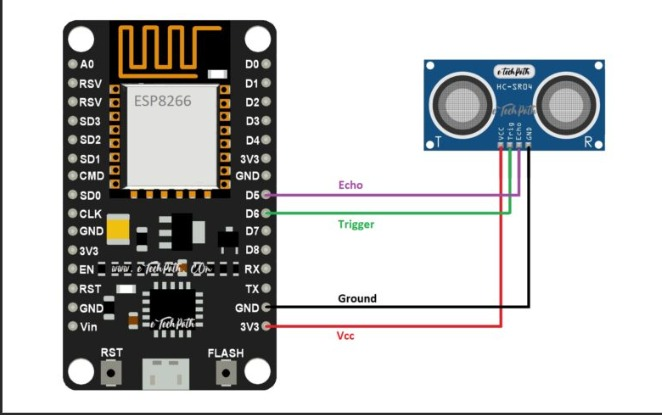
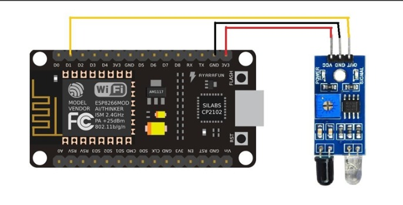
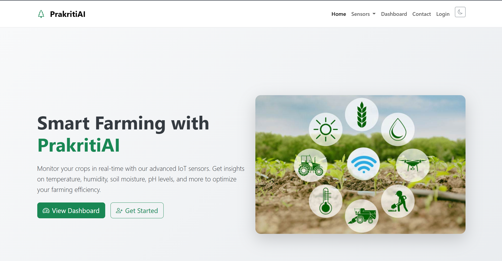
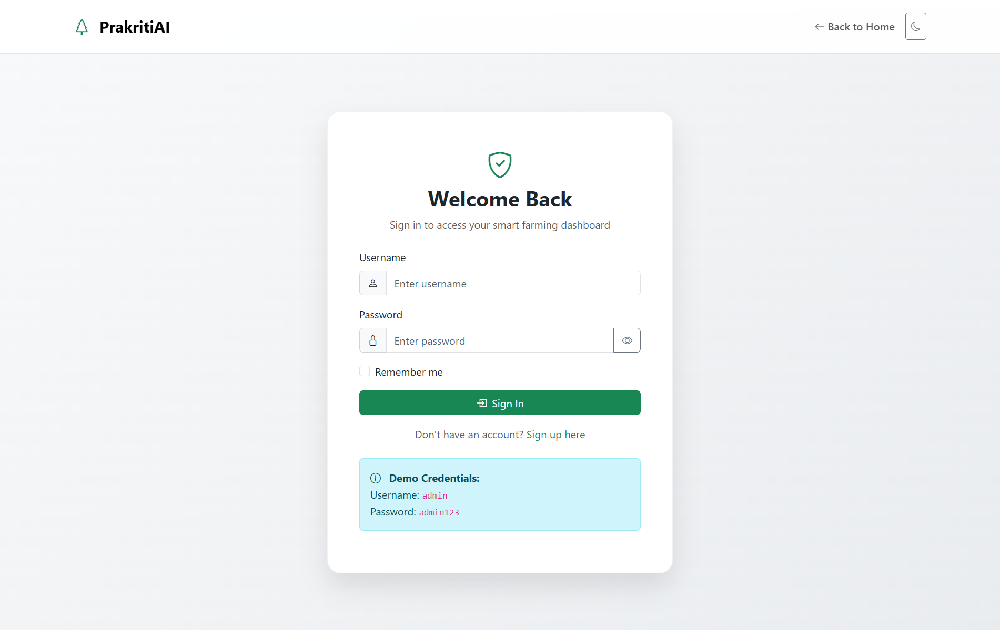
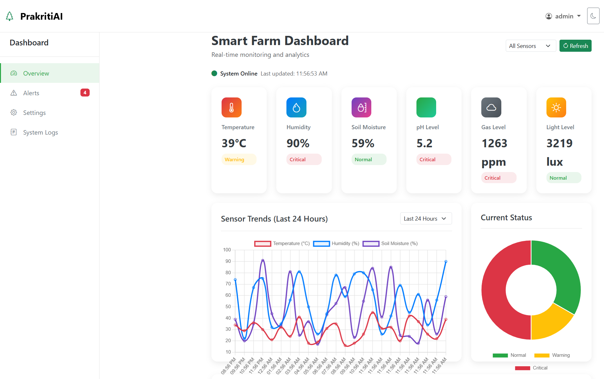
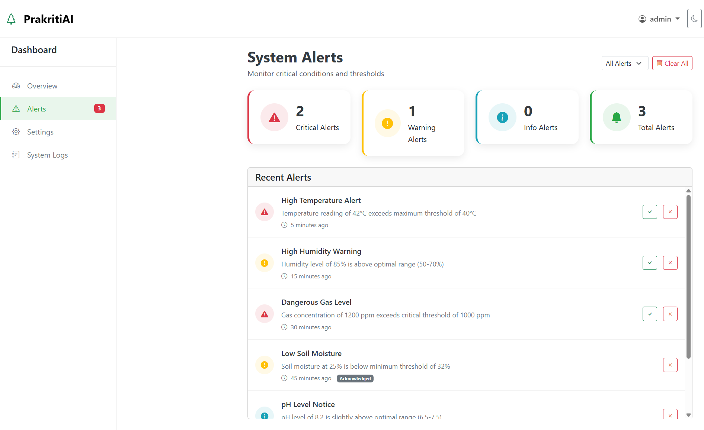

# 🌿 PrakritiAI – Smart Farming Monitoring System

PrakritiAI is a smart farming monitoring web app that helps track environmental conditions like temperature, humidity, pH, soil moisture, and gas levels in real-time. The goal is to support farmers with clear, live data and easy-to-understand visuals so they can take better care of their crops.

## 🔧 Features

- 📡 Real-time monitoring of sensor data
- 📊 Dashboard with visual charts and summaries
- ⚠️ Alerts for abnormal readings based on thresholds
- ⚙️ User-defined threshold settings
- 🧠 Simple and clean UI for quick decision-making

## 🖥️ Tech Stack

### 🔹 Hardware Components
- **NodeMCU (ESP8266):** Microcontroller for sensor integration and data transmission  
- **Sensors:**
  - Temperature & Humidity: *DHT11*
  - Soil Moisture: *YL-69*
  - Air Quality: *CO, CO₂, PM2.5*, etc.  
- **Raspberry Pi:** Acts as a central hub for data processing and storage  

### 🔐NodeMCU (ESP8266) integrated with Sensors

## Ultrasonic-sensor


## IR-Sensor

### 🔹 Communication Protocol
- **MQTT:** Lightweight protocol for real-time data transfer
- **Wi-Fi Connectivity:** For transmitting data from sensors to Raspberry Pi and cloud servers

### 🔹 Data Storage
- **Local Storage:** SQLite3 / MySQL on Raspberry Pi
- **Cloud Storage:** Firebase / AWS IoT Core / Google Cloud for scalability and remote access

### 🔹 Data Processing & Preprocessing
- **Python Libraries:** Pandas, NumPy, SciPy for data cleaning and transformation
- **Edge Computing:** Raspberry Pi filters and preprocesses sensor data before cloud upload

### 🔹 Machine Learning Integration *(Future Scope)*
- **Libraries:** Scikit-learn, TensorFlow for predictive analytics
- **Techniques:**
  - Forecasting soil moisture
  - Air quality anomaly detection
  - Time series pattern recognition
  - AI-based recommendations for irrigation and pollution control

## 📱 User Interface

### 🔹 Mobile Application
- **Tech:** Flutter (Dart) / React Native for cross-platform support
- **Data Sync:** Firebase Realtime Database / REST API
- **Features:**
  - Live data visualization (charts, graphs)
  - Custom alerts & threshold notifications
  - Historical data and trend analysis

### 🔹 Web Dashboard
- **Backend:** Django (Python) for server-side logic, authentication, and templating
- **Frontend:**
  - HTML / CSS (Bootstrap)
  - JavaScript for interactivity, AJAX, dynamic updates
- **Templating:** Django templates integrated with Bootstrap for a responsive UI

## ✅ Testing & Deployment

### 🔹 Unit & Integration Testing
- **Software:** Pytest / Selenium / JUnit  
- **Hardware:** Calibration and validation of real-world sensor outputs

### 🔹 Cloud Deployment
- **AWS IoT Core** for cloud-based data ingestion and analytics

### 🔹 Mobile App Deployment
- **Google Play Store / Apple App Store** for end-user access

### 🔹 Version Control & CI/CD
- **GitHub / GitLab CI/CD** for version management and automated deployment


## 📷 Screenshots

### 🔐 Welcome Page


### 🔐 Login Page


### 📊 Dashboard with Sensor Data


### ⚠️ Alert for Abnormal Values



## 🚀 How to Run Locally

```bash
git clone https://github.com/priyanshgolwalkar/prakritiai.git
cd prakritiai
npm install
npm run dev
